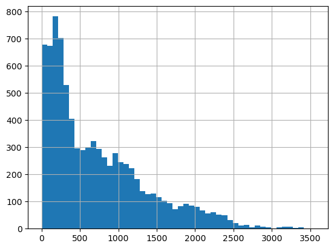
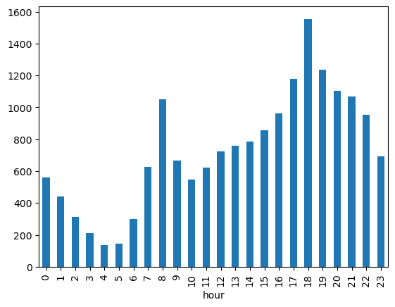
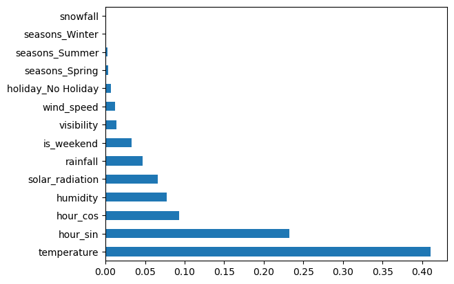
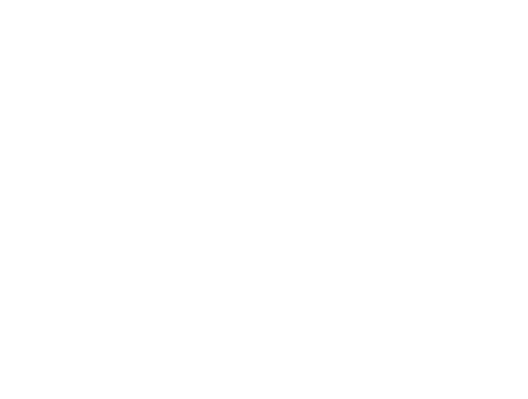

# Seoul Bike Sharing Demand Forecast

A regression project predicting hourly bike rental demand in Seoul based on weather and time data.

## Business Problem

Bike-sharing operators need to know how many bikes will be needed at each hour so they can redistribute bikes across stations in advance — avoiding both shortages and unused surplus bikes. This project builds a model that forecasts hourly demand using weather and time features.

## Dataset

- **Source:** [Seoul Bike Sharing Demand](https://archive.ics.uci.edu/dataset/560/seoul+bike+sharing+demand), UCI Machine Learning Repository
- **Size:** 8,760 hourly records (Dec 2017 – Nov 2018), 8,465 after cleaning
- **Features:** temperature, humidity, wind speed, visibility, solar radiation, rainfall, snowfall, season, holiday status, hour of day
- **Target:** `rented_bike_count` — number of bikes rented in that hour

## Workflow

EDA → Data Cleaning → Feature Engineering → Modeling → Evaluation → Interpretation

## Data Cleaning

- Removed 295 rows where `Functioning Day = No` (system was offline, target trivially 0 — not a real demand signal)
- Converted `Date` from text to datetime format
- Renamed columns to snake_case
- No missing values or duplicates found in the raw dataset

## EDA — Key Findings

The target variable is right-skewed: most hours have low-to-moderate demand, with a long tail up to 3,556.



Demand follows a clear commute pattern on weekdays (peaks at 8:00 and 18:00), while weekends show no morning peak.



## Feature Engineering

- Cyclical encoding of hour (`hour_sin`, `hour_cos`) so that 23:00 and 00:00 are treated as close together, not far apart
- One-hot encoded `season` and `holiday`
- Dropped `dew_point_temperature` (0.91 correlation with `temperature` — redundant)
- Tested a log transform on the target; it made the skew worse, so the target was kept untransformed
- Created `is_weekend` flag

## Modeling

Train/test split was done chronologically (85/15), not randomly, to avoid leaking future information into training. The training set covers Dec 2017–Oct 2018 (all seasons, including summer); the test set covers Oct–Nov 2018 (Autumn only).

| Model | MAE | RMSE | R² |
|---|---|---|---|
| Naive baseline (always predict mean) | 442.2 | 565.3 | 0.000 |
| Linear Regression | 315.3 | 412.9 | 0.439 |
| **Random Forest** | **258.1** | **353.3** | **0.589** |
| Gradient Boosting (default) | 268.9 | 370.5 | 0.548 |
| Gradient Boosting (tuned) | 272.7 | 374.3 | 0.539 |

Random Forest performed best and was selected as the final model. Tuning Gradient Boosting did not improve results. Linear Regression underperformed both tree-based models, consistent with EDA showing non-linear demand patterns that a straight-line model can't capture well.

## Interpretation

Feature importance from Random Forest shows temperature as the single most important feature, followed by hour of day (`hour_sin`/`hour_cos` combined). Season features contribute almost nothing on their own, likely because temperature already captures most of that seasonal information.



SHAP values confirm the direction of these effects: higher temperature and higher solar radiation push predicted demand up, while rainfall pushes it down. `is_weekend` has low overall importance but still matters — it changes *when* during the day demand happens rather than the average demand level, which a simple correlation could not show.



## Limitations

- Only one year of data is available, so the test set (Autumn only) doesn't cover every season
- Gradient Boosting tuning used a limited random search (20 iterations); a wider search might change the comparison
- The model doesn't account for special local events beyond the binary holiday flag

## Tech Stack

Python, pandas, numpy, scikit-learn, SHAP, matplotlib

## Repository Structure

```
├── data/
│   └── bike_data_clean.csv
├── notebooks/
│   ├── 01_clean.ipynb
│   └── 02_modeling.ipynb
├── images/
├── requirements.txt
└── README.md
```

